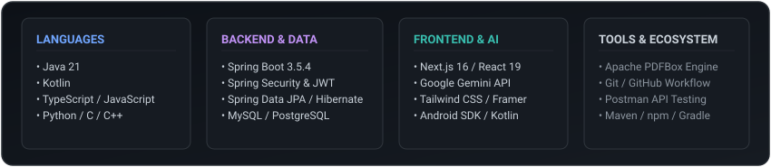
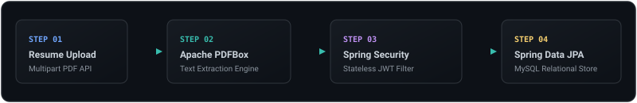
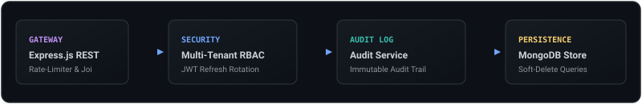
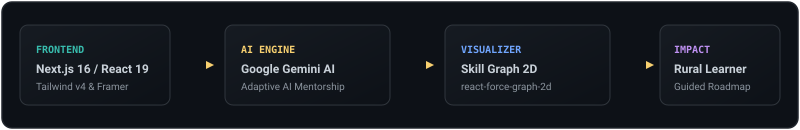

<div align="center">

  

  <br><br>

  [](https://github.com/Akillesh2006)
  [](https://github.com/Akillesh2006?tab=followers)
  [](https://leetcode.com/u/Akillesh2006/)

</div>

<br>

```bash
┌──(akillesh⚡kernel)-[~]
└─$ akillesh --inspect-system
[IDENTITY]   Akillesh K P · Computer Science & Engineering @ CIT (2024–2028)
[SPECIALTY]  Backend Systems Architecture · Native Android · Full-Stack AI Integration
[PLATFORMS]  SkillBridge (Spring Boot) | AI DevOps Monitor (Node/Mongo) | Adaptive Community (Next.js)
[BENCHMARK]  LeetCode: 402 Solved (206E / 189M / 7H) | SkillRack: 119 Solved | 3 Internships
```

<br>

## 👤 Executive Overview

I am a Computer Science & Engineering student at **Chennai Institute of Technology** (2024–2028), designing backend microservices, Android mobile applications, and AI-driven telemetry systems.

Through software engineering internships at **Google**, **Tiranex**, and **Alfido Tech**, I focus on building enterprise-grade REST APIs, stateless security layers, automated document processing engines, and intelligent AI mentorship tools.

```java
public class Engineer {
    public final String name = "Akillesh K P";
    public final String degree = "B.E. Computer Science & Engineering";
    public final String institution = "Chennai Institute of Technology (2024–2028)";
    public final String[] coreFocus = {
        "Spring Boot 3.5 & Java 21 Microservices",
        "Node.js & Express DevOps Telemetry",
        "Android SDK & Kotlin Mobile Engineering",
        "Next.js 16 & Google Gemini AI Platforms"
    };
}
```

<br>

## 🛠️ Technical Ecosystem & Stack Matrix

<div align="center">
  
</div>

<br>

| Domain | Verified Stack & Tools |
|---|---|
| **Languages** | `Java 21` `Kotlin` `TypeScript` `Python` `JavaScript (ES6+)` `C` `C++` |
| **Backend & Security** | `Spring Boot 3.5.4` `Node.js` `Express.js` `Spring Security` `JWT (jjwt)` `Multi-Tenant RBAC` |
| **AI & Web Systems** | `Next.js 16 (App Router)` `React 19` `Google Gemini AI API` `Apache PDFBox 3.0.3` `Tailwind v4` |
| **Databases & Data** | `MySQL` `MongoDB (Mongoose)` `PostgreSQL` `Spring Data JPA` `Audit Logging` |
| **Mobile & Visuals** | `Android SDK` `Kotlin Jetpack` `Framer Motion` `react-force-graph-2d` |
| **Tools & Testing** | `Git` `Postman` `Android Studio` `Maven` `npm` `Gradle` `Jest` |

<br>

## 🚀 Flagship Architecture & Platforms

### 1. [SkillBridge](https://github.com/Akillesh2006/SkillBridge) — AI Career Guidance Platform

> **AI-powered career guidance and placement preparation platform tailored for CSE students.**

SkillBridge transforms raw student resumes into structured skill gap analyses and targeted learning roadmaps.

<div align="center">
  
</div>

<br>

#### Verified System Architecture
- **Framework & Runtime**: Spring Boot 3.5.4 on Java 21 (JDK 21)
- **Data Persistence**: Spring Data JPA with MySQL relational store
- **Security Context**: Spring Security with stateless JWT (`io.jsonwebtoken:jjwt:0.12.7`) filters
- **Document Engine**: Apache PDFBox (`org.apache.pdfbox:pdfbox:3.0.3`) for resume PDF parsing

#### Verified Implementation Status
- 🟢 **Implemented (Verified in Code)**: REST controllers (`AuthController`, `ProfileController`, `ResumeController`, `UserController`), stateless JWT auth filters, JPA entities (`User`, `Resume`), MySQL integration, Apache PDFBox text extraction.
- 🟡 **In Development**: Resume keyword parsing & skill extraction algorithms.
- 🔵 **Planned**: AI learning roadmap generator, mock interview evaluator, career readiness scoring, native Android client app.

🔗 **Repository:** [github.com/Akillesh2006/SkillBridge](https://github.com/Akillesh2006/SkillBridge)

---

### 2. [AI DevOps Monitoring Platform](https://github.com/Akillesh2006/AI-Powered-DevOps-Monitoring-Platform) — Telemetry & Audit Engine

> **Enterprise multi-tenant DevOps monitoring backend featuring granular RBAC permissions and immutable audit trails.**

An enterprise telemetry platform built to enforce tenant isolation, fine-grained role permissions, and system auditability.

<div align="center">
  
</div>

<br>

#### Architecture & Security Stack
- **Runtime & Gateway**: Node.js, Express.js REST API with rate-limiting & Joi schema validation
- **Persistence & Scoping**: MongoDB, Mongoose ORM with custom scoped soft-delete queries
- **Security & RBAC**: Multi-tenant organization scoping, JWT Access & Refresh Token Rotation, Bcrypt password hashing
- **Testing**: Complete Jest integration & unit test suite

#### Key Capabilities
- 🏢 **Multi-Tenant Scoping**: Isolated organization queries ensuring strict tenant separation.
- 🔒 **Fine-Grained RBAC**: Permission matrix enforcing administrative, operational, and reader access controls.
- 📜 **Immutable Audit Logs**: Centralized logging engine tracking all user lifecycle events and security actions.

🔗 **Repository:** [github.com/Akillesh2006/AI-Powered-DevOps-Monitoring-Platform](https://github.com/Akillesh2006/AI-Powered-DevOps-Monitoring-Platform)

---

### 3. [Adaptive Community](https://github.com/Akillesh2006/Adaptive-Community) — Rural Learning Platform

> **AI-powered adaptive learning and mentorship platform engineered for rural communities.**

Adaptive Community delivers intelligent personalized learning paths to rural learners using Google Generative AI and interactive 2D skill graph visualizers.

<div align="center">
  
</div>

<br>

#### System Architecture & Stack
- **Framework & Web**: Next.js 16 (App Router), React 19, TypeScript
- **AI Mentorship Engine**: Google Gemini API (`@google/generative-ai`)
- **Interactive Graphing**: Dynamic 2D graph node visualizer via `react-force-graph-2d`
- **UI Architecture**: Tailwind CSS v4, Framer Motion, Radix UI primitives, Lucide React

🔗 **Repository:** [github.com/Akillesh2006/Adaptive-Community](https://github.com/Akillesh2006/Adaptive-Community)

<br>

## 💼 Professional Experience

| Role | Organization | Duration | Focus Area |
|---|---|---|---|
| **UI/UX Intern** | **Tiranex** | May 2026 – Jun 2026 | User flow architecture & interface prototyping |
| **Android Developer Virtual Intern** | **Google** | Oct 2025 – Dec 2025 | Mobile architecture, Kotlin patterns & Android SDK |
| **Frontend Developer Intern** | **Alfido Tech** | May 2024 – Jun 2024 | Web interface implementation & responsive design |

<br>

## 🧩 Problem Solving Footprint

<div align="center">

| Platform | Total Solved | Category Breakdown |
|:---:|:---:|---|
|  **LeetCode** | **402** | **Easy:** 206 &nbsp;·&nbsp; **Medium:** 189 &nbsp;·&nbsp; **Hard:** 7 |
| 🎯 **SkillRack** | **119** | **C:** 83 &nbsp;·&nbsp; **Python:** 28 &nbsp;·&nbsp; **C++:** 7 &nbsp;·&nbsp; **Java:** 1 |

</div>

<br>

## 🔥 Viewers & Contribution Streak

<div align="center">
  
</div>

<br>

<div align="center">
  
  &nbsp;&nbsp;
  
</div>

<br>

## 🎯 Active Learning Focus

- 🏗️ **Distributed Systems & System Architecture**: Microservice scalability & database sharding
- 📱 **Modern Mobile Architecture**: Jetpack Compose state management & Kotlin Multiplatform
- 🤖 **AI System Integration**: Embedding Gemini & LLM intelligence into backend production flows
- ⚡ **Advanced DSA**: Dynamic programming, graph algorithms, and space/time optimization

<br>

## 📬 Connect & Collaborate

<div align="center">

  [](https://github.com/Akillesh2006)

</div>

<br>

<div align="center">
  
</div>
